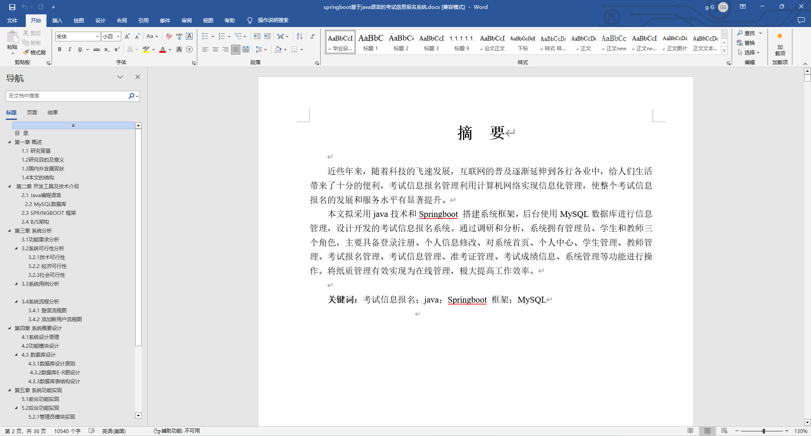
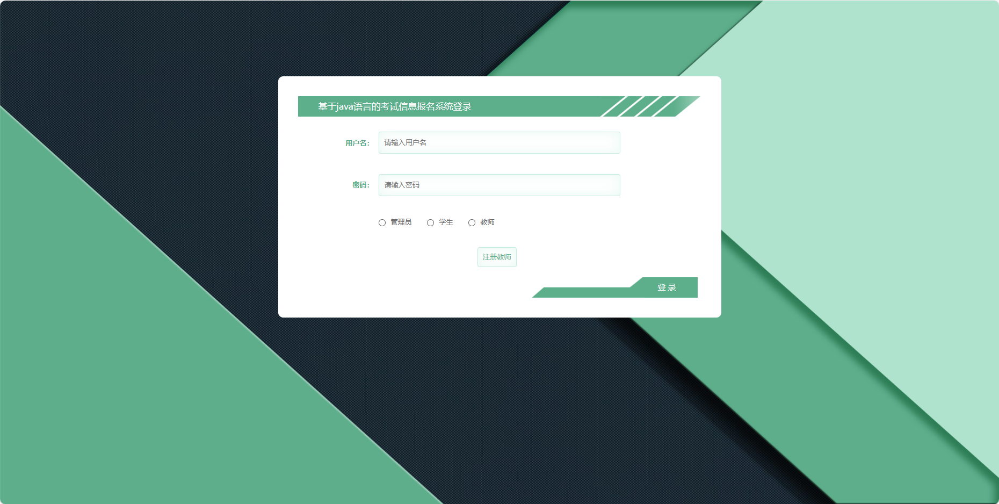
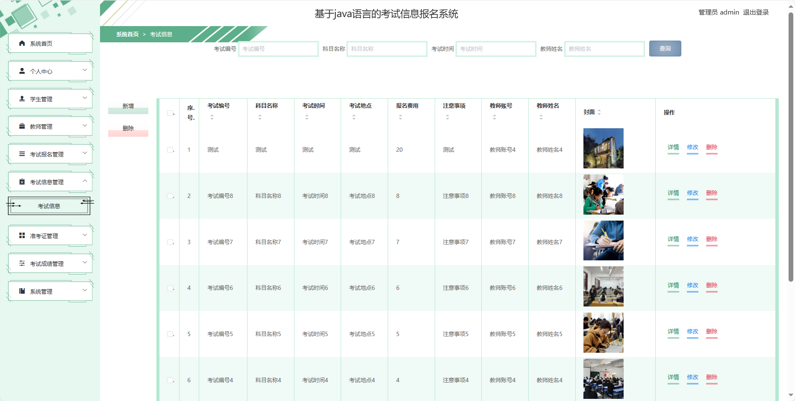
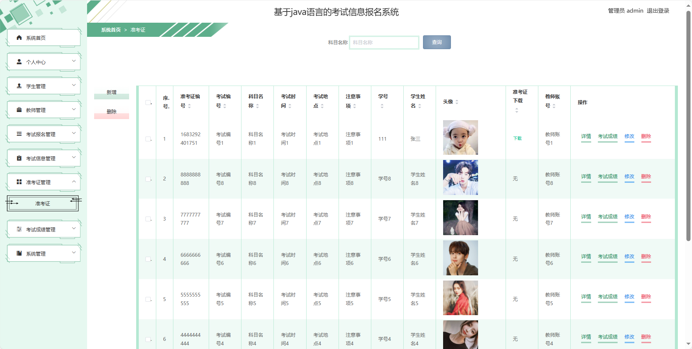
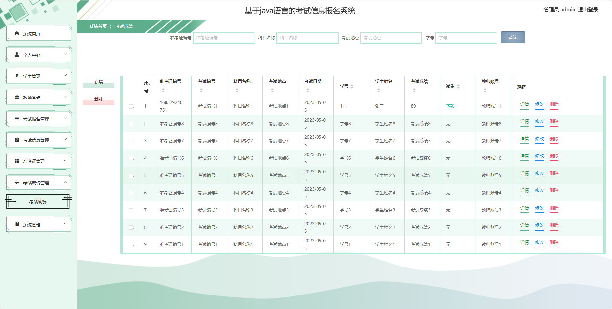
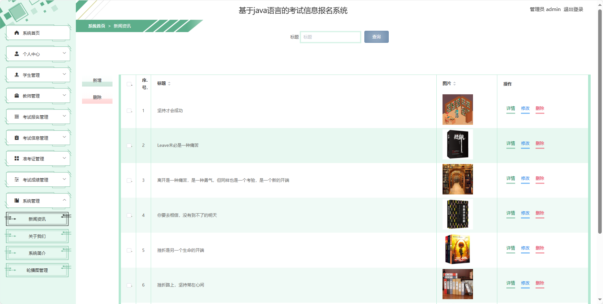
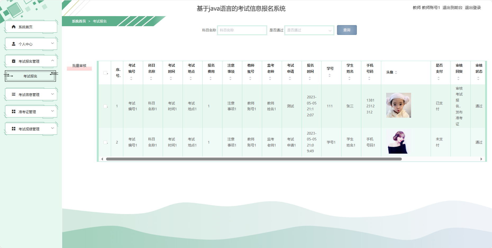
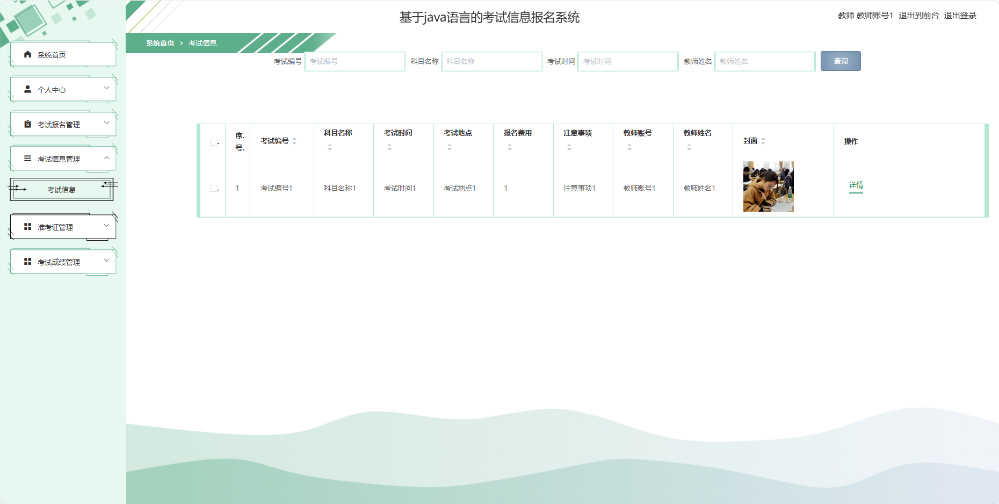
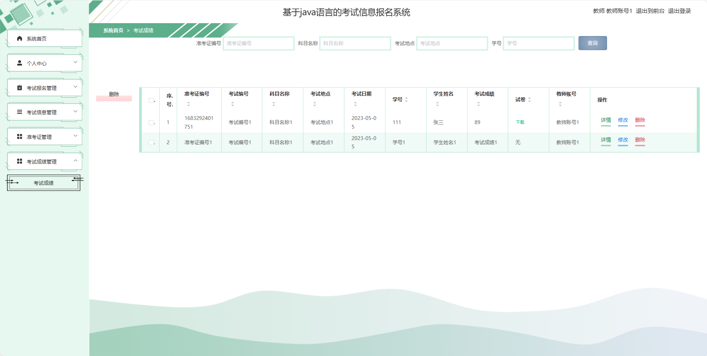

## 基于SpringBoot的考试信息报名系统(程序+报告)

###  获取sql数据库文件: 从戎源码网 (https://armycodes.com/) QQ: 386869957 QQ群: 377586148
###  所有系统地址: (https://github.com/YuLin-Coder/AllProjectCatalog) 
###  所有项目以及源代码本人均调试运行无问题 可支持远程安装部署调试、定制修改、代码讲解

## 项目介绍
基于SpringBoot的考试信息报名系统，系统包含三种角色：管理员、用户，教师,系统分为前台和后台两大模块，主要功能如下。

### 【管理员】:
1. 系统首页：提供管理员、教师、学生进入后台管理的入口。
2. 个人中心：管理员、教师、学生均可以管理个人信息
3. 管理员管理：添加、编辑、删除系统管理员账号。
4. 学生管理：添加、编辑、删除学生账号。
5. 教师管理：添加、编辑、删除教师账号。
6. 考试报名管理：教师和学生均可以进行考试报名。
7. 考试信息管理：管理员和教师可以添加、编辑、删除考试信息。
8. 准考证管理：管理员和教师可以生成、查看、管理准考证信息。
9. 考试成绩管理：教师可以录入、修改学生的考试成绩。
10. 系统管理：管理员可以进行系统的基本设置。

### 【前台】:
1. 首页：提供用户进入系统的入口。
2. 考试信息：用户可以查看当前和将来的考试信息。
3. 新闻资讯：发布与考试相关的新闻、通知和资讯。
4. 后台管理：提供管理员、教师、学生进入后台管理的入口。
5. 个人中心：用户可以管理个人信息。

## 项目技术
- 编程语言：Java
- 数据库：MySQL
- 项目管理工具：Maven
- 前端技术：HTML、CSS、JavaScript、Jquery、Vue
- 后端技术：Spring、SpringMVC、MyBatis

## 运行环境
- JDK版本：JDK1.8及以上
- 开发工具：IDEA、Ecplise、Myecplise都可以
- 数据库: MySQL5.7及以上
- Maven：maven3.0及以上
- Node：14.14.0及以上

## 运行截图

